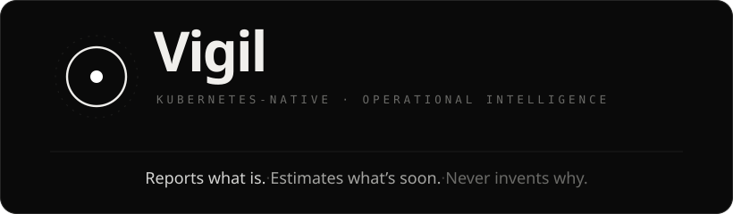

<p align="center">
  
</p>

<p align="center">
  <a href="#quickstart"></a>
  <a href="#the-forecasting-engine"></a>
  <a href="#the-knowledge-graph"></a>
  <a href="#determinism-as-a-contract"></a>
  <a href="#validation--falsification"></a>
  
  
</p>

<p align="center">
  <b>An observability engine that detects what is failing now, forecasts what crosses a limit soon,<br>
  and refuses to invent why.</b> Built for complex, dependency-heavy Kubernetes environments —<br>
  cluster-agnostic, deterministic, and honest about its own blind spots.
</p>

<p align="center">
  <a href="#what-vigil-is">What it is</a> ·
  <a href="#where-conventional-observability-falls-short">Why it exists</a> ·
  <a href="#the-operating-principle">Principle</a> ·
  <a href="#architecture-at-a-glance">Architecture</a> ·
  <a href="#capability-map">Capabilities</a> ·
  <a href="#intelligence-layers">Intelligence</a> ·
  <a href="#onboarding-flow">Onboarding</a> ·
  <a href="#operational-workflows">Workflows</a> ·
  <a href="#quickstart">Quickstart</a> ·
  <a href="#go-deeper">Go deeper</a>
</p>

---

## What Vigil is

Vigil is a Kubernetes-native operational intelligence framework. It does three things and
deliberately refuses to pretend it does more:

- **Watches** — continuously scrapes a cluster and maintains a truthful, time-aware model of
  its entities and the dependencies between them.
- **Detects** — recognizes *failure phenomena*: not isolated metric crossings, but authored
  patterns of co-occurring states across topologically related entities, with cascade
  recognition and blast-radius derivation.
- **Forecasts** — projects imminent threshold crossings on a scarce, budgeted set of series,
  always with an uncertainty band that never collapses to false precision.

Around that core, Vigil joins distinct sources of operational truth — Kubernetes events,
distributed traces, the API-server audit log, network flow, logs — to its findings, and
surfaces everything to an operator (or an AI agent) under one strict rule: **every statement
carries the class of knowledge it came from, and the classes are never silently merged.**

The result is not another alert firehose. It is an instrument: it tells you what is happening,
what is likely about to happen, what changed just before, and — crucially — what it is *not*
watching and why.

> **Reports what is. Estimates what's soon. Never invents why.**

---

## Where conventional observability falls short

Most monitoring stacks become untrustworthy at the exact moment you need them: during an
incident. They fuse measured facts, learned baselines, and human guesses into a single opaque
"alert," and when that alert is wrong, the operator has no way to see *why*. Vigil is engineered
against each of those failure modes.

| Conventional approach | The problem it creates | How Vigil approaches it |
|---|---|---|
| Static per-metric thresholds | Either noisy or blind; never right across heterogeneous clusters | **Borrowed normativity** — bars come from the customer's *own* declared limits and SLOs; undeclared series are listed as unbounded, never silently defaulted |
| Learned/ML anomaly baselines | Hidden per-customer state that drifts and can't be explained or reproduced | **Three primitives only** (threshold · rate · co-occurrence); no baselines, no fits, no scores on the detection path — by commitment |
| Single-metric alerts | Alert storms; the real story (a cascade) is buried | **Phenomena** — authored multi-signal patterns across related entities; a single crossing is never an alert |
| Correlation presented as cause | Confident, plausible, and frequently wrong | **Causal direction is only ever human-authored**; correlation and co-occurrence are surfaced *as* correlation |
| Opaque "AI root cause" | Unfalsifiable; no provenance; no audit trail | **Provenance classes that join, never fuse** — measured, projected, and authored knowledge stay labelled and separable |
| Black-box pipelines | A finding can't be reproduced or trusted under pressure | **Determinism by construction** — every tick is byte-identically replayable from pinned inputs |
| Silent coverage gaps | You don't know what you're *not* watching | **The silence ledger** — a provable negative: what is unwatched, and the stated reason |

The honest trade is this: Vigil is *narrower* than a typical AIOps product, and far more
rigorous about its edges. It is a symptom detector, a dependency-intelligence layer, and a
narrow forecaster — and it tells you, by construction, exactly where its vision ends.

---

## The operating principle

One discipline governs the entire codebase — the
[**epistemic separation charter**](docs/01-epistemic-separation-charter.md). Understand it and
the rest of the system becomes legible.

Every datum the system holds is exactly one **provenance class**, assigned at birth. They are
distinguished by *form*, not decoration:

| Class | Means | Register | Carried by form |
|---|---|---|---|
| **MEASURED** | A fact from the store, or its arithmetic consequence | indicative — *"is"* | solid |
| **PROJECTED** | A model's forecast against a bar, with a mandatory band | modal — *"might"* | banded — **never a line** |
| **AUTHORED** | A curated graph note, surfaced verbatim and attributed | attributed — *"per the graph"* | quoted |

The cardinal rule is **join, never fuse**. When the classes meet — and they meet in exactly one
place, the surfacing layer — they are composed *adjacently*, each keeping its label. A finding
is "these MEASURED states co-occurred in this AUTHORED pattern"; it is never collapsed into a
generated sentence like "X caused Y."

Four prohibitions follow, and each is enforced mechanically, not by convention:

1. **Never invent causation.** Causal direction is only ever authored by a named human.
2. **Never invent thresholds.** Bars are borrowed from the customer's own declarations.
3. **Never learn per-customer state.** The detection vocabulary is three arithmetic primitives.
4. **Never let the model gate the engine.** Detection is byte-identical whether forecasting, the
   agent, alerting, and every modality lane are present, degraded, or absent.

### Determinism as a contract

The deterministic path obeys: *same readings + same resolved bars + same graph version + same
parameters ⇒ the same findings, always.* This is verified, not asserted. Each live tick computes
a SHA-256 digest of its results; a replay engine re-runs a captured bundle through the **real**
components and recomputes the digest from disk. A mismatch fails loudly. Under incident pressure,
an operator can reproduce any finding byte-for-byte from pinned inputs — no hidden state, no
nondeterministic ML in the loop.

### The firewall

Everything that is *not* deterministic — forecasting, the LLM agent, association, causal
hypotheses, the modality lanes — lives **off the digest**, behind a firewall enforced by tests.
A suite of import-graph tests fails the build if any deterministic package even transitively
imports a speculative one. The deterministic core *cannot* read speculative data, even by
accident.

---

## Architecture at a glance

Vigil is a Go modular monolith (`obsd`) with strict internal boundaries, paired with a Python
forecasting clock (`clockd`), a Python falsification harness (`harness`), a curated ontology, and
a React operator console.

```
   Kubernetes cluster                      obsd  (Go modular monolith)
   ┌────────────────┐   scrape   ┌───────────────────────────────────────────────┐
   │ cAdvisor       │──────────▶ │  ①  DETERMINISTIC SPINE   (the replay digest)  │
   │ node-exporter  │            │     identity → qss → observe → binding →        │
   │ kube-state-m.  │            │     selection → detect → unexplained → replay   │
   │ app /metrics   │            │                      │                          │
   └────────────────┘            │                      │ Tier-B targets (snapshot)│
   ┌────────────────┐            │                      ▼                          │     clockd (Python)
   │ K8s events     │──────────▶ │  ②  FORECASTING   (off-digest, non-gating) ─────┼──▶  TimesFM 2.5 /
   │ OTel spans     │──────────▶ │     eligibility→budget→decompose→regime-shift→   │     stub clock
   │ audit log      │──────────▶ │     trend→calibrate→project                      │   (bare floats only)
   │ conntrack/flow │──────────▶ │                                                 │
   │ logs           │──────────▶ │  ③  INFERENCE & MODALITY LANES  (firewalled)    │
   └────────────────┘            │     onset(CUSUM)·departure·assoc·cohypothesis    │
                                 │     flow·incident·events·trace·audit·logs        │
                                 │                                                 │
                                 │  ④  PROPOSE → VERIFY → PROMOTE                   │
                                 │     dgx(agent) → candidate(firewalled) →         │
                                 │     governance(gates) → AUTHORED overlay         │
                                 │                                                 │
                                 │  ⑤  SURFACING   (the one place classes meet)    │
                                 │     api (JSON) · mcp (read-only) · notify        │
                                 └──────────────────┬──────────────────────────────┘
                                                    │ /api   /mcp
                              ┌─────────────────────▼─────────┐   ┌────────────────────┐
                              │ console (React · dark UI)      │   │ harness (Python)   │
                              │ provenance carried by form     │   │ 21 falsification   │
                              └────────────────────────────────┘   │ gates              │
                                                                    └────────────────────┘
```

**Why a modular monolith.** The engine's correctness depends on every evaluation tick observing a
*complete, consistent* snapshot of readings and topology. A single process with one store gate
delivers that for free; a distributed design would have to rebuild the consistency guarantee at
far higher cost and would put determinism at the mercy of network ordering. The package
boundaries are strict (each carries a `doc.go` charter), so the system is modular in every sense
except deployment.

**Why the language split.** Go owns everything that must be deterministic, CGO-free, and
cross-platform-identical (the engine). Python owns the two genuinely statistical concerns where
its ecosystem is strongest: the TimesFM forecasting model and the offline backtest/falsification
suite. The two connect only through a **semantics-free contract** — the forecasting wire carries
no string fields at all, so the model never sees a label, a unit, or any graph structure, and any
conformant model is a drop-in.

---

## Capability map

<table>
<tr>
<td width="33%" valign="top">

**Detection**
- Topological phenomena (entity-local, first- & second-order)
- Cascade recognition
- Blast-radius derivation
- Degraded-match honesty (names what it couldn't observe)
- Edge-validity-gated traversal

</td>
<td width="33%" valign="top">

**Forecasting**
- TimesFM 2.5, swappable clock
- Footprint subtraction (forecast the remainder, not the reset)
- Regime-shift contamination flag
- Trend-rescue early warning
- Churn-stable role-series
- Non-collapsing uncertainty bands

</td>
<td width="33%" valign="top">

**Dependency intelligence**
- Observed network flow (conntrack)
- Observed call graph (OTel spans)
- Transitive root-cause chains
- Projected multi-hop cascades
- Association graph (windowed Pearson)

</td>
</tr>
<tr>
<td valign="top">

**Anomaly & change**
- CUSUM onset timing
- Band-departure detection
- Kubernetes event ingestion
- Audit-log change tracking
- Log-template mining
- The unexplained channel

</td>
<td valign="top">

**Reasoning & causality**
- Direction-free causal hypotheses
- Offline causal discovery (PCMCI)
- Cross-run incident identity
- Timeline reconstruction
- MCP synthesis relay for AI agents

</td>
<td valign="top">

**Governance & growth**
- Propose → verify → promote spine
- Blast-radius change classification
- Regression-gated releases
- Versioned, hash-pinned ontology
- LLM agent that proposes, never writes

</td>
</tr>
</table>

---

## Intelligence layers

Vigil's depth is best understood as layers of reasoning stacked on the deterministic core. Each
is grounded; none fabricates.

### Detection — phenomena, not metrics
The ontology's phenomena *are* the detection units; there is no separate playbook. A phenomenon
lights up when its member signals reach their threshold states in the **authored temporal
pattern** (precursors → event → consequence), with required members mandatory and supporting
members strengthening. First- and second-order phenomena walk only the phenomenon's declared edge
types — and **every traversed edge's validity interval must overlap the co-occurrence window**, so
a 2-hop correlation can never be fabricated through a stale edge. A degraded match names exactly
what it couldn't observe; a single crossing is never an alert.

### Dependency intelligence — the chain reaction
Vigil discovers service dependencies as *observed facts*: TCP flow reconstructed from Linux
conntrack (with DNAT recovery to the real backend), and the service call graph aggregated from
OpenTelemetry spans. It then stitches measured-degraded workloads into an **ordered root-cause
chain** over those edges — oriented *only* by an authored cross-service relation, never by timing.
A cardinal rule holds: coincident-but-unrelated faults produce *separate* chains, never one merged
story. The forecasting equivalent — the projected cascade — inherits a forecast root's uncertainty
band and **widens it per hop**, so the ripple is shown with honestly growing, never collapsing,
uncertainty.

### Anomaly understanding — timing and departure
Anomaly detection is deliberately scoped and explainable. A two-sided **CUSUM** on EWMA residuals
computes the deterministic *time* a series stepped, with sustained-shift confirmation to reject
transient blips. (A live bake-off against ADWIN and Page-Hinkley settled the choice on evidence:
CUSUM leads a gentle creep ~10× faster — and the creep is exactly what early warning exists for.)
**Band departure** flags a measured sample that fell outside the very forecast band its own clock
drew — "my own forecast did not anticipate this" — with the margin scaled to the band's own width,
so noisy series get wide bands and don't false-fire.

### Forecasting — the narrow clock
Forecasting answers one question: *when does this number cross that number.* The model is
TimesFM 2.5 behind a semantics-free contract; everything that makes the answer *mean* something is
authored knowledge joined only at the surface. The pipeline is disciplined for real clusters:
**footprint subtraction** splices history at the last confirmed reset so the model forecasts the
clean remainder rather than the next sawtooth; a **regime-shift flag** detects an undeclared
baseline step and marks the band as possibly contaminated (but never trims a *ramp* — a ramp is
the leak signal it exists to find); a **trend-rescue** path catches a slow creep the variance gate
would miss; and **role-series** forecasting follows the durable workload role through pod churn
(rollouts, HPA, OOM-restarts) that breaks per-pod approaches.

### Causal reasoning — surface the lead, refuse the arrow
This is where Vigil is most disciplined. It surfaces **direction-free** co-occurrence hypotheses
(two coupled series stepped together within a window) and an offline causal-discovery shortlist
(fixed-lag enrichment + PCMCI conditional-independence pruning) — but it stages them as
*candidates for a human to adjudicate*, never as asserted causes. The empirical lesson, reproduced
in its own harness, is that auto-discovered direction is unreliable; the honest move is to use
inference to **prune and rank**, and let a named operator author the arrow.

### Governance — growth without corruption
The graph grows through a one-directional spine: an LLM agent **proposes** typed candidate
extensions from read-only measured context (with a grounding gate that rejects any evidence it
didn't actually see), candidates are **staged** in a firewalled store off the deterministic path,
and a **named human promotes** them through regression gates that scale with blast radius. The
tooling can *block* a release; it can never *approve* one. Every authored assertion carries an
identity and evidence.

### Surfacing — where it all comes together honestly
The API composes the classes adjacently (a view is literally labelled, e.g.
`MEASURED ⋈ AUTHORED (joined, never fused)`); a charter linter scans serialized payloads for any
fused causal prose as a backstop. A read-only **MCP relay** exposes the whole classed picture to
AI agents so they can synthesize a cause *from grounded facts* — with a `validate_claim` referee
that labels (and never blocks) and an `emit_advisory` tool that refuses a fabricated cause
outright. An off-digest **alerting lane** emails classed facts with full fatigue control
(cooldown, rate-limit, quiet hours, coalescing) and the same register discipline ("projected to
cross," never "will").

---

## Cluster-agnostic by design

Vigil makes no rigid assumptions about the cluster it runs on. Generalization is structural, not
configured:

- **Identity is exact-match-or-quarantine.** Every entity and stream is joined by a Canonical
  Entity Identity minted from stable coordinates. A stream that cannot be normalized is
  *quarantined* (counted, surfaced) — never guessed onto the wrong entity, because a mis-join is
  the silent killer.
- **Bars are borrowed, not hardcoded.** Thresholds resolve per-instance from the customer's own
  config and SLO annotations. Nothing about a specific service or namespace is baked in (verified
  clean of service/namespace coupling).
- **Capabilities are detected, not assumed.** Each authored signal is gated against what *this*
  cluster actually runs (tools, kernel versions, distro). A signal whose prerequisite is absent is
  out-of-scope *with a reason*, never a silent failure.
- **The ontology is the same for everyone.** A single curated, versioned knowledge graph binds
  onto any cluster; what differs per-cluster is only the binding and coverage report, computed
  fresh at discovery time.

This is what lets the same engine run identically across a local `kind` cluster, a boutique
microservices demo, and a heavyweight enterprise simulation — with an honest coverage vector for
each, rather than a one-size-fits-none configuration.

---

## Onboarding flow

Bring-up is intentionally simple — point Vigil at a cluster and it self-describes what it can and
cannot see.

```
  1. CONNECT        Read-only kubeconfig → obsd discovers the inventory
        │
  2. IDENTIFY       Mint CEIs for every entity & role; quarantine the unjoinable (counted)
        │
  3. BIND           Compile the ontology onto the cluster: resolve bars, gate capabilities,
        │           run semantic QA → a per-entity coverage report
        │
  4. SELECT         The attention funnel picks what to watch (Tier A) and what to forecast
        │           (Tier B, budgeted) — every entity gets a reason code
        │
  5. WATCH          The deterministic tick runs; findings, cascades, and early warnings stream
        │           to the console and the API
        │
  6. EXTEND         Optionally enable modality lanes, the forecasting clock, alerting, and the
                    agent — each off by default, each byte-identical when off
```

Detection requires only a read-only RBAC and a metrics source. Every additional lane is opt-in via
an explicit `--*-enabled` flag, and the system stays byte-identical with each lane off — so you
adopt capability incrementally, never all-or-nothing. The full runbook lives in
[`docs/24-bringup-and-onboarding-runbook.md`](docs/24-bringup-and-onboarding-runbook.md) and
[`docs/16-cluster-onboarding.md`](docs/16-cluster-onboarding.md).

---

## Operational workflows

How the system is actually used, end to end:

- **Triage a live incident.** Open the console → a phenomenon finding shows the co-occurring
  measured states, the authored "why" quoted verbatim, and the blast radius. The root-cause chain
  orders the degraded workloads over observed dependencies. The audit lane answers "what changed
  just before this?" — pruned by the arrow of time, surfaced as adjacency, never as cause.

- **Catch it before it fires.** The early-warnings surface shows series *projected to cross* a bar,
  each with a non-collapsing band and the precursor phenomenon it would trigger. The projected
  cascade shows where the ripple would reach, with uncertainty widening per hop.

- **Reconstruct the timeline.** Incidents have deterministic cross-run identity, so a condition
  that fires, resolves, and re-fires is one incident with a recurrence count — the timeline reads
  as a coherent story, not a flood of duplicates.

- **Understand coverage.** The coverage report and silence ledger state precisely what is watched,
  what is unbounded (no declared bar), and what is structurally invisible — so blind spots are a
  measured fact, not a surprise during an incident.

- **Let an agent reason.** An MCP-connected AI reads the full classed picture and synthesizes a
  cause and remediation *from grounded facts*, with every claim provenance-labelled and any
  fabrication refused at the boundary.

- **Grow the knowledge.** Recurring unexplained anomalies and stray metrics become candidate
  proposals; a named human promotes the good ones through governance gates into the next ontology
  release.

---

## Quickstart

**Prerequisites:** Go 1.26 · [`just`](https://github.com/casey/just) · [`buf`](https://buf.build)
· [`uv`](https://docs.astral.sh/uv) (Python 3.12) · Node 22 + pnpm (console) ·
Docker + kind + kubectl + helm (for a live cluster). All Go is CGO-free; `go test` runs anywhere.

```sh
# ── verify the engine (runs anywhere) ──────────────────────────────
just test            # go test -race ./...   — the standing determinism gate
just lint            # go vet + gofmt + buf lint
go run ./tools/graphlint     # validate the ontology against the schema

# ── run the runtime ────────────────────────────────────────────────
just obsd            # the runtime skeleton with embedded dev params
just clockd-test     # ruff + pytest for the forecasting clock
just harness-test    # ruff + pytest for the backtest primitives

# ── bring up a live cluster (Linux box) ────────────────────────────
just up              # create the 3-node kind cluster
just boutique        # deploy the microservices demo workload
just console-dev     # the operator console (Vite dev server)

# ── falsification gates (each proves one claim; exit 0 = passed) ────
just transitive-chain-gate     # the root-cause chain never merges independent faults
just departure-gate            # band-departure never false-fires on a stationary series
just regime-shift-gate         # an undeclared baseline step is flagged; a ramp never is
just validate-claim-gate       # the referee never blocks truth, never misses fabrication
#   …21 gate recipes in total — see `just --list`
```

See [`DEVELOPMENT.md`](DEVELOPMENT.md) for the cross-platform contract (macOS writes, Linux
builds and tests; every `just` recipe behaves identically on both).

---

## What sets Vigil apart

- **Provenance is a type, not a label.** Measured, projected, and authored knowledge are kept
  structurally separate and only ever joined adjacently — so a finding can always be decomposed
  into its sources.
- **Determinism you can prove.** Every tick is byte-identically replayable. No learned state sits
  on the path that produces a finding.
- **It refuses to guess causes.** Causal direction is exclusively human-authored; everything else
  is honest correlation, co-occurrence, or observed structure.
- **It admits what it cannot see.** The silence ledger and blind-spot surface make coverage gaps a
  first-class, measured output.
- **Capability grows safely.** A firewalled propose→verify→promote spine lets an AI agent and
  automated discovery extend the graph without ever corrupting the deterministic core.
- **Honest under failure.** Forecasting, the agent, and every modality lane are non-gating — the
  engine is byte-identical whether they are present, degraded, or absent.

---

## Repository map

| Path | What it is |
|---|---|
| [`obsd/`](obsd) | The Go runtime core — 30+ internal packages, each with a `doc.go` charter |
| [`obsd/internal/`](obsd/internal) | identity · qss · observe · binding · selection · detect · forecast · flow · governance · candidate · dgx · mcp · notify · … |
| [`clockd/`](clockd) | The Python forecasting clock (TimesFM 2.5 + an honest stub) behind the no-strings contract |
| [`harness/`](harness) | The Python falsification & backtest suite — 21 gates, plus the anomaly bake-off and causal-discovery |
| [`ontology/`](ontology) | The curated knowledge graph (release **v0.13.0**) + authored overlays + release manifests |
| [`proto/`](proto) | The semantics-free clock contract (no string fields, enforced by a conformance test) |
| [`console/`](console) | The React/TypeScript operator console — provenance carried by form, on the monochrome plane |
| [`tools/graphlint/`](tools/graphlint) | Ontology schema validation + release-immutability gates |
| [`deploy/`](deploy) | kind cluster config (boutique + enterprise sim), read-only RBAC, add-on workloads |
| [`simulator/`](simulator) | The failure/chaos simulator |
| [`docs/`](docs) | The full design suite (`00`–`30` + `techstack.md`) |
| [**`SYSTEM-INDEX.md`**](SYSTEM-INDEX.md) | **The canonical system intelligence document** (see below) |

---

## Go deeper

This README is the entry point. For complete architectural and code-level understanding — the math
behind every engine, the rationale behind every design choice, and a file-by-file trace of the
codebase — read the canonical reference:

### → [**`SYSTEM-INDEX.md`**](SYSTEM-INDEX.md) — the whole-system intelligence map

It explains the forecasting models, anomaly mathematics (CUSUM, band-departure), dependency and
causal reasoning, the governance machinery, and the determinism contract in full, grounded depth.

Supporting material:

- [`docs/`](docs) — the numbered design suite: the charter (`01`), ontology spec (`02`), identity
  (`03`), binding (`04`), observation (`05`), selection (`06`), detection (`07`), the unexplained
  channel (`08`), forecasting (`09`), surfacing (`10`), the harness (`11`), governance (`12`), and
  the extension tracks (`15`–`30`).
- [`DEVELOPMENT.md`](DEVELOPMENT.md) — the developer & cross-platform build contract.
- [`docs/techstack.md`](docs/techstack.md) — the technology stack and component layout.
- Each package's `doc.go` — the authoritative per-module contract.

---

## Status & license

Vigil is an actively developed research-and-engineering system. The deterministic core,
forecasting clock, modality lanes, governance spine, and operator console are implemented and
exercised by the falsification harness and live cluster simulations. Current status is tracked in
[`artifacts/task.md`](artifacts/task.md).

**License:** TBD.

<p align="center">
  <sub>Vigil — the honest instrument. Reports what is. Estimates what's soon. Never invents why.</sub>
</p>
